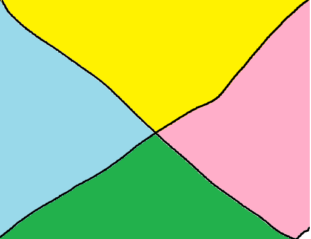
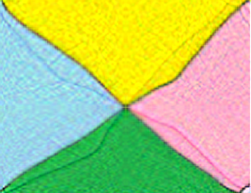
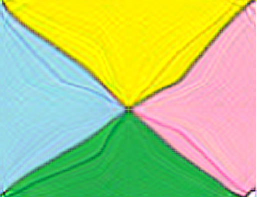
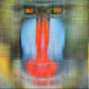
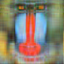
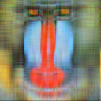
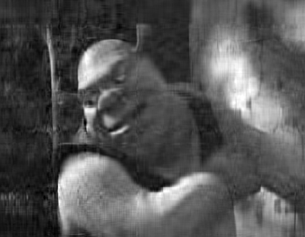

# Эксперимент

---
Прилагаю источники используемых алгоритмов:

- [numpy.linalg.svd](https://numpy.org/doc/stable/reference/generated/numpy.linalg.svd.html) - `NpSVD`
- [power method SVD](https://www.jeremykun.com/2016/05/16/singular-value-decomposition-part-2-theorem-proof-algorithm/) - `PowerSVD`
- [block power method SVD](https://www.emis.de/journals/ASUO/mathematics/anale2015vol2/Bentbib_A.H.__Kanber_A..pdf) - `BlockSVD`

---

## Время выполнения

Реализация алгоритма в `NumPy` намного быстрее, чем `Power` и `Block power`, которые работают примерно одинаково. Время выполнения двух последних напрямую
зависит от точности вычислений (epsilon) при этом значение эпсилон незначительно влияет на качество сжатия(по крайней мере мой глаз не заметил никакой разницы) 
при значениях меньше 0.1. Поэтому эмпирически было решено использовать именно такую точность

## Сравнение результатов

### Условия эксперимента:

- Степень сжатия изображения была выбрана равной 2
- Для `Power` и `Block` методов используется точность `epsilon=0.1`

### Простое цветное изображение

| Исходное                                      | NumPy                                                       | Power                                                        | Block                                                          |
|-----------------------------------------------|-------------------------------------------------------------|--------------------------------------------------------------|----------------------------------------------------------------|
|    |  |  |  |

Можно заметить, что `Power` заметно проигрывает двум другим. У него получилось очень шумное изображение. `Block` и `NumPy` методы примерно одинаковые, 
хотя мне кажется, что у `Block` метода всё-таки немного более шумное изображение, чем у `NumPy`

### Цветное изображение с объектом посередине и подписями сверху и снизу

| Исходное                                      | NumPy                                                       | Power                                                        | Block                                                          |
|-----------------------------------------------|-------------------------------------------------------------|--------------------------------------------------------------|----------------------------------------------------------------|
|    |  |  |  |

Ситуация схожая с предыдущим примером. С надписями все три метода справились одинаково хорошо, в то время как лягушка чуть-чуть шумнее у `Power` метода, 
чем у двух других

### Высококонтростное изображение с множеством цветов и надписью посередине

| Исходное                                                      | NumPy                                                                         | Power                                                                          | Block                                                                            |
|---------------------------------------------------------------|-------------------------------------------------------------------------------|--------------------------------------------------------------------------------|----------------------------------------------------------------------------------|
|  |  |  |  |

Заметим, что в левой и правой частях изображения появились полосы, которые немного менее выражены у `Power` метода, что несомненно является плюсом.
Однако, с надписью все три метода справились одинаково плохо, особенно с буквой М, потому что в исходном изображение там проходит черная полоса. А обводка 
буквы М имеет такой же цвет

### Кадр из мультфильма с персонажем и множеством мелких деталей

| Исходное                                | NumPy                                                   | Power                                                    | Block                                                      |
|-----------------------------------------|---------------------------------------------------------|----------------------------------------------------------|------------------------------------------------------------|
|  |  |  |  |

В данном примере, как мне кажется, `NumPy` метод показал себя намного лучше двух других. `Power` метод очень зашакалил изображение и опять появилось много шумов.
`Block` метод показал себя получше, чем `Power`, однако хуже, чем `NumPy`. Прошу обратить внимание на подбородок персонажа. В `NumPy` ярко выражен подбородок и 
тень, которую он отбрасывает, в то время, как у `Block` метода все всмешалось в одно месиво. То же можем наблюдать, посмтрев на уши, пальцы, скулы и другие изгибы
на стыке зеленого с черным

### Кадр из мультфильма с персонажем и множеством мелких деталей моно

| Исходное                                        | NumPy                                                           | Power                                                            | Block                                                              |
|-------------------------------------------------|-----------------------------------------------------------------|------------------------------------------------------------------|--------------------------------------------------------------------|
|  |  |  |  |

Тут сложно выявить лидера или аутсайдера, по моему мнению, все картинки выглядят максимально плохо

### Низкокачественное цветное изображение крупным планом

| Исходное                                        | NumPy                                                           | Power                                                            | Block                                                              |
|-------------------------------------------------|-----------------------------------------------------------------|------------------------------------------------------------------|--------------------------------------------------------------------|
|  |  |  |  |

Заметим, что отсутствие цветов уравнивает шансы всех методов, тут уже не видно сильного шума от `Power` метода или проигрыша `Block` метода при работе с тенями. Смею утдверждать, что в данном случае метода +- равны

## Выводы

Можно выявить следующие отличительные черты алгоритмов:
- Алгоритмы плохо справляются с цветными изображениями, на которых есть сложные объекты, например, персонажи или животные
- Алгоритмы справляются довольно хорошо с текстом и простыми объектами
- Алгоритмы легко запутать, добавив оттенки похоже цвета рядом, с каким-то объектом или текстом(тени у шрека, надпись в высококонтрастном изображении)
- `Power` метод в среднем имеет больше шумов, чем остальные

Алгоритмы можно поставить в топ:
- `NumPy` - очень быстро работает, лучшее качество
- `Block` - достойное качество, медленно работает
- `Power` - медленно работает, очень много шумов
